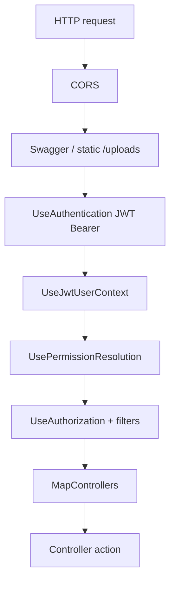
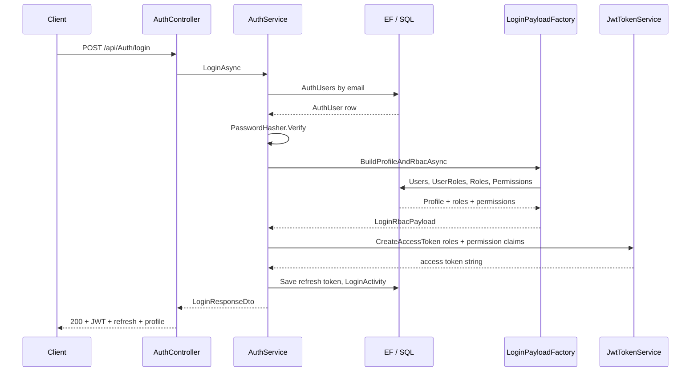
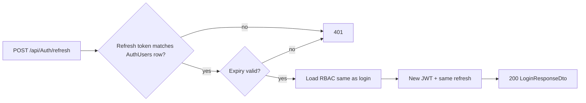
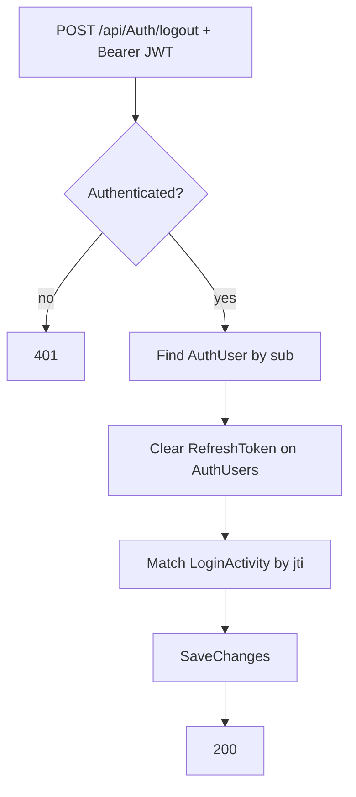
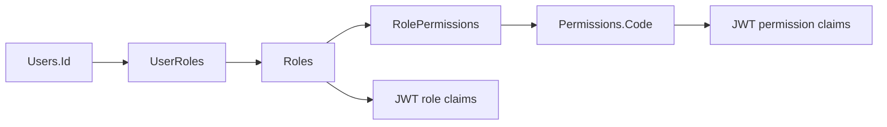
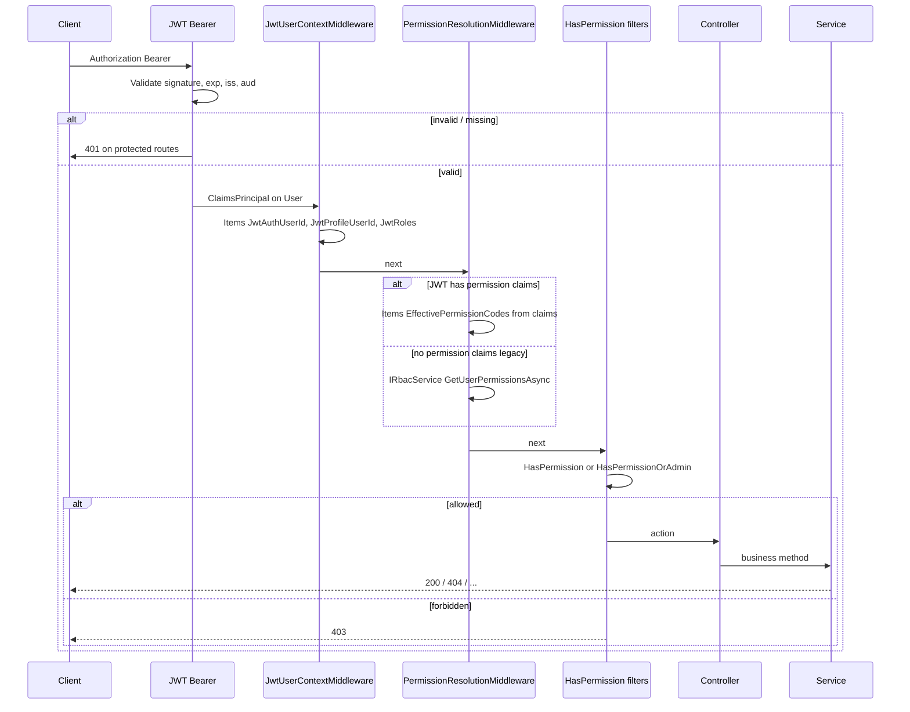
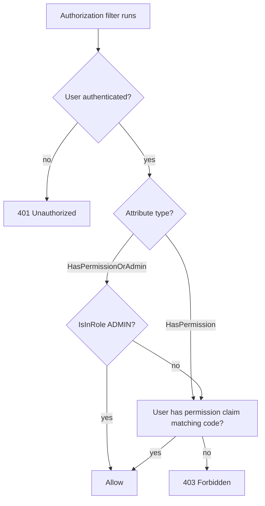

# Code workflow

This document describes how **HTTP requests** move through the Gym Management solution: middleware, authentication, authorization, and application layers. Pair it with [DatabaseArchitectureByModule.md](./DatabaseArchitectureByModule.md) for table-level detail and **entity-relationship diagrams**.

**Diagrams below:** pipeline order, login / refresh / logout, RBAC → JWT, authenticated request, permission filters, plus a compact RBAC chain.

---

## 1. Solution layout (high level)

| Project | Responsibility |
|---------|----------------|
| **GymManagement.API** | ASP.NET Core host: controllers, middleware, `Program.cs`, Swagger. |
| **GymManagement.Core** | DTOs, interfaces, authorization constants (`PermissionCodes`), JWT claim names. |
| **GymManagement.Domain** | Entity classes (tables). |
| **GymManagement.Infrastructure** | EF Core (`ApplicationDbContext`), repositories / `UnitOfWork`, services (`AuthService`, `JwtTokenService`, feature services), seeding. |

Dependency direction: **API** → **Infrastructure** + **Core**; **Infrastructure** → **Domain** + **Core**.

---

## 2. HTTP request pipeline (`Program.cs`)

Order matters. Relevant pieces for a typical API call:

1. **CORS** — browser cross-origin rules for the React app.
2. **Swagger / SwaggerUI** — interactive API docs (development).
3. **Static files** — `/uploads` serves uploaded images (configured **before** auth so public URLs work as designed).
4. **`UseAuthentication()`** — JWT Bearer middleware reads `Authorization: Bearer <token>`, validates signature/issuer/audience/lifetime, and builds **`HttpContext.User`** (`ClaimsPrincipal`).
5. **`UseJwtUserContext()`** — custom middleware: copies JWT claims onto **`HttpContext.Items`** (`JwtAuthUserId`, `JwtProfileUserId`, `JwtRoles`) for convenience.
6. **`UsePermissionResolution()`** — if the user is authenticated, resolves effective permissions: prefers **`permission`** claims on the JWT; if none (legacy token), loads from the database via **`IRbacService`** using profile `userId`.
7. **`UseAuthorization()`** — runs authorization policies and MVC filter pipeline (including `[Authorize]`, `[HasPermission]`, `[HasPermissionOrAdmin]`).
8. **`MapControllers()`** — routes to controller actions.

**Important:** Authentication runs **before** authorization. Permission data is available on the request **after** `UsePermissionResolution()` and **before** controller filters that depend on `HasPermission`.

### Diagram: middleware order (incoming request)

---

## 3. Login and token issuance

**Entry:** `POST /api/Auth/login` → `AuthController` → `IAuthService.LoginAsync`.

**Flow (simplified):**

1. Resolve **`AuthUsers`** by email; verify password with **`PasswordHasher`** (BCrypt).
2. Optional profile load via **`AuthUsers.UserId`** → **`Users`**.
3. **`LoginPayloadFactory.BuildProfileAndRbacAsync`** loads profile, app roles, and permissions (queries **`UserRoles`**, **`Roles`**, **`RolePermissions`**, **`Permissions`**).
4. Role names for JWT come from **`UserRoles`** → **`Roles.Name`**.
5. **`IJwtTokenService.CreateAccessToken`** builds a signed JWT:
   - `sub` = auth user id  
   - `userId` = profile id (when linked)  
   - `jti` = session id  
   - role claims + one **`permission`** claim per distinct permission code  
6. Refresh token is stored on **`AuthUsers`** (plain text + expiry); **`LoginActivity`** records the session.

**Refresh:** `POST /api/Auth/refresh` — validates stored refresh token + expiry, rebuilds JWT the same way (RBAC loaded again for current roles/permissions).

**Logout:** `POST /api/Auth/logout` — requires a valid JWT; clears refresh token on **`AuthUsers`** and updates **`LoginActivity`** when `jti` matches.

### Diagram: login (happy path)

### Diagram: refresh token

### Diagram: logout

### Diagram: RBAC chain → JWT claims (at login / refresh)

---

## 4. Authenticated API request

**Entry:** Any controller with `[Authorize]` and usually `[HasPermission(...)]` or `[HasPermissionOrAdmin(...)]`.

**Flow:**

1. **JWT Bearer** validates token → **`User`** is authenticated.
2. **`JwtUserContextMiddleware`** fills **`Items`** with parsed ids/roles.
3. **`PermissionResolutionMiddleware`** sets **`HttpContext.Items`** keys for effective permission codes (from JWT or DB fallback). **`HttpContextPermissionExtensions`** can read DTO lists / code sets if needed.
4. **`HasPermissionAttribute`** (authorization filter) checks **`User`** for a matching **`permission`** claim (JWT-first design).
5. **`HasPermissionOrAdminAttribute`** allows **`ADMIN`** **or** the required permission claim (role check via `IsInRole("ADMIN")`).
6. **Controller action** runs, calls an **application service** (e.g. `IUserService`, `IAttendanceLogService`) registered in DI from **Infrastructure**.
7. Service uses **`IUnitOfWork`** / **`ApplicationDbContext`** to read/write entities and **`SaveChangesAsync`** as needed.

Errors are returned as normal HTTP status codes (401 unauthenticated, 403 forbidden, 404, etc.).

### Diagram: JWT request (after login)

### Diagram: `[HasPermission]` vs `[HasPermissionOrAdmin]`

---

## 5. Where to change behavior

| Concern | Primary location |
|--------|------------------|
| JWT settings (key, lifetime, issuer) | `appsettings.json` → `Jwt:*`, `Program.cs` JWT Bearer options |
| Token contents (claims) | `JwtTokenService`, `IJwtTokenService` |
| Login / refresh / logout rules | `AuthService`, `AuthController` |
| Permission resolution order (JWT vs DB) | `PermissionResolutionMiddleware` |
| Per-endpoint permission | Controller attributes: `PermissionCodes`, `HasPermission`, `HasPermissionOrAdmin` |
| Business rules for a feature | `GymManagement.Infrastructure/Services/*Service.cs` + interfaces in **Core** |
| Schema / tables | **Domain** entities + `ApplicationDbContext` + migrations |

---

## 6. Related files (quick reference)

- Pipeline: `src/GymManagement.API/Program.cs`
- JWT user context: `src/GymManagement.API/Middleware/JwtUserContextMiddleware.cs`
- Permissions on request: `src/GymManagement.API/Middleware/PermissionResolutionMiddleware.cs`
- Permission filters: `src/GymManagement.API/Attributes/HasPermissionAttribute.cs`, `HasPermissionOrAdminAttribute.cs`
- Permission constants: `src/GymManagement.Core/Authorization/PermissionCodes.cs`
- Auth: `src/GymManagement.Infrastructure/Services/AuthService.cs`, `JwtTokenService.cs`

Keep this file aligned when you add middleware or change the order of `Use*` calls in `Program.cs`. Mermaid diagrams render in GitHub, VS Code (with a Mermaid preview), and many wikis.
