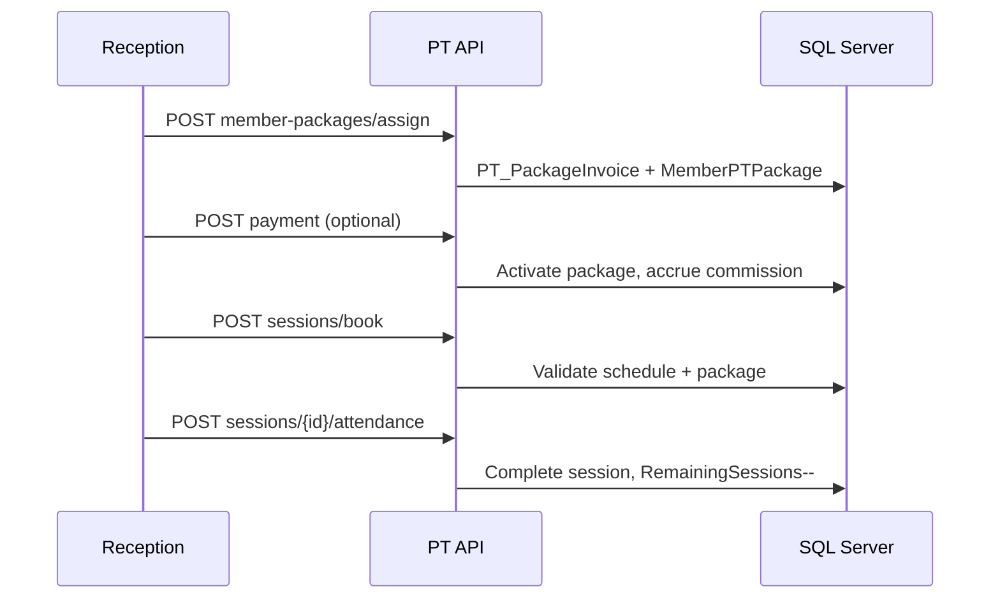

# Personal Training (PT) Module

## Overview

The PT module extends the existing Gym Management stack without duplicating members, trainers, or users. Members are `User` records; trainers are `Trainer` (1:1 with `User`). Billing uses dedicated `PT_PackageInvoices` (category `PTPackage`) parallel to retail POS and membership payments.

## Folder structure

```
src/GymManagement.Domain/Entities/PersonalTraining/   # Entities + enums
src/GymManagement.Core/DTOs/PersonalTraining/         # DTOs
src/GymManagement.Core/Services/PersonalTraining/      # Service interfaces
src/GymManagement.Infrastructure/Services/PersonalTraining/  # Implementations
src/GymManagement.Infrastructure/Data/PersonalTrainingModelConfiguration.cs
src/GymManagement.API/Controllers/PersonalTraining/    # REST APIs

gym_client/src/types/personalTraining.ts
gym_client/src/services/personalTraining.service.ts
gym_client/src/modules/personal-training/pages/
```

## Database tables (`PT_*`)

| Table | Purpose |
|-------|---------|
| `PT_Packages` | Package catalog (sessions, validity, price, tax) |
| `PT_PackagePrices` | Optional trainer-specific price overrides |
| `PT_PackageInvoices` | Billing header (invoice category: Membership / Product / **PTPackage**) |
| `PT_MemberPackages` | Member subscription (remaining sessions, expiry, freeze) |
| `PT_MemberPackageHistory` | Audit trail (purchase, freeze, payment, session deduct) |
| `PT_TrainerSchedules` | Weekly availability |
| `PT_TrainerLeaves` | Leave / unavailable dates |
| `PT_Sessions` | Booked sessions |
| `PT_SessionHistory` | Status changes |
| `PT_Attendance` | Member/trainer presence, no-show |
| `PT_CommissionRules` | Per-trainer commission config |
| `PT_Commissions` | Accrued commissions |
| `PT_Payouts` | Monthly settlement |
| `PT_Notifications` | In-app notifications (SMS/email-ready `Channel` field) |

All entities inherit `BaseEntity` (`Id`, `CreatedDate`, `UpdatedDate`, `IsDeleted`) with soft-delete query filters.

## Permissions

| Code | Roles (seeded) |
|------|----------------|
| `MANAGE_PT_PACKAGES` | ADMIN, STAFF |
| `BOOK_PT_SESSIONS` | ADMIN, STAFF, TRAINER |
| `MANAGE_PT_SCHEDULES` | ADMIN, STAFF, TRAINER |
| `VIEW_TRAINER_EARNINGS` | ADMIN, TRAINER |
| `VIEW_PT_REPORTS` | ADMIN, STAFF |

Re-login or wait for permission middleware merge after deploy.

## Deployment / migration

```bash
# Local
dotnet ef database update --project src/GymManagement.Infrastructure --startup-project src/GymManagement.API

# VPS (after git pull)
./deploy/scripts/update.sh
```

Stop the running API process before `dotnet build` if files are locked on Windows.

## API examples

### Create package

`POST /api/pt/packages` (requires `MANAGE_PT_PACKAGES`)

```json
{
  "packageName": "10 Session Pack",
  "packageType": "SessionBased",
  "totalSessions": 10,
  "validityDays": 90,
  "price": 15000,
  "taxPercentage": 18,
  "defaultDiscountAmount": 0,
  "isActive": true
}
```

### Assign package to member

`POST /api/pt/member-packages/assign`

```json
{
  "userId": 12,
  "trainerId": 3,
  "packageId": 1,
  "paidAmount": 15000,
  "notes": "Front desk sale"
}
```

Response includes `invoiceNumber`, `remainingSessions`, `expiryDate`, `paymentStatus`.

### Book session

`POST /api/pt/sessions/book`

```json
{
  "memberPTPackageId": 5,
  "scheduledStartUtc": "2026-06-01T10:00:00Z",
  "scheduledEndUtc": "2026-06-01T11:00:00Z"
}
```

Validates: active package, sessions remaining, not expired, trainer availability, no overlap.

### Mark attendance (deducts session on completion)

`POST /api/pt/sessions/{id}/attendance`

```json
{
  "memberPresent": true,
  "trainerPresent": true,
  "isLate": false,
  "isNoShow": false
}
```

## Booking flow



## Commission flow

1. Commission accrues only when `PaymentStatus = Paid` (package) or session completed after paid package.
2. Rule resolution: trainer + optional package-specific rule (`PT_CommissionRules`).
3. Types: `Percentage`, `FixedPerSession`, `PackageBased`.
4. Monthly `POST /api/pt/commissions/payouts?trainerId=&year=&month=` marks approved commissions paid.
5. Cancellation/refund: `ReverseCommissionForSessionAsync` sets status `Reversed`.

## Frontend routes

- `/dashboard/personal-training` — Dashboard
- `/dashboard/personal-training/packages` — Package CRUD
- `/dashboard/personal-training/assign` — Assign package
- `/dashboard/personal-training/sessions` — Session list / calendar base
- `/dashboard/personal-training/reports` — Reports + CSV export

## Optional extensions (not implemented)

Waitlist, recurring bookings, QR check-in, trainer ratings, workout/diet assignment, WhatsApp — schema can be extended under `PT_*` without breaking existing tables.
