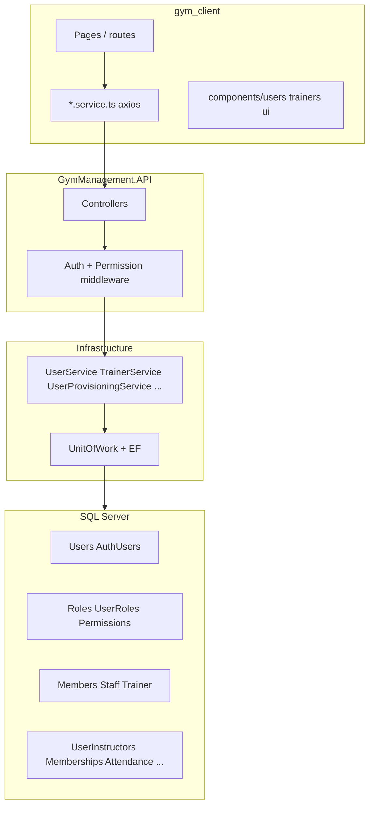
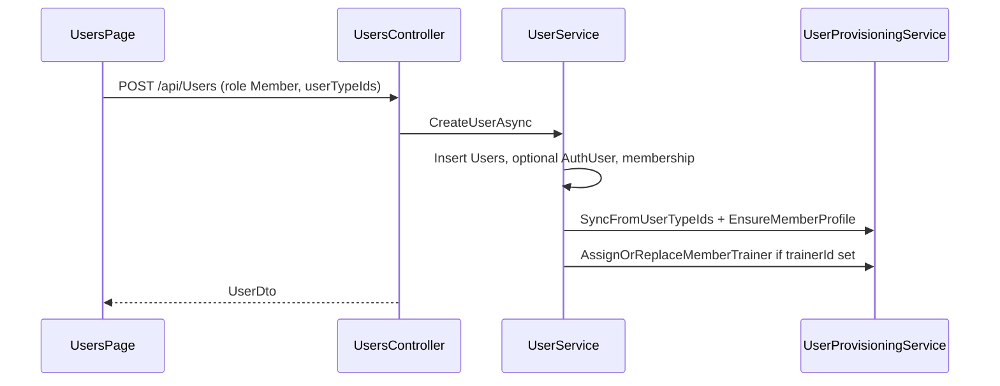
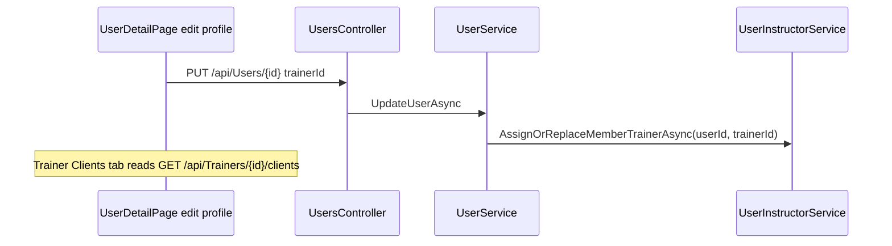

# Application flows & product model

**Purpose:** Single source of truth for how the Gym Management app works end-to-end. Use this before adding features so we extend existing flows instead of duplicating logic.

**Related docs:**

| Doc | Contents |
|-----|----------|
| [CodeWorkflow.md](../CodeWorkflow.md) | HTTP pipeline, JWT, RBAC middleware |
| [USER_ROLE_ARCHITECTURE.md](./USER_ROLE_ARCHITECTURE.md) | Roles, profiles (`Members`, `Staff`, `Trainers`), provisioning |
| [PT_MODULE.md](../PT_MODULE.md) | Personal training packages & sessions |
| [USER_GUIDE.md](../USER_GUIDE.md) | End-user operations |
| [README.md](./README.md) | Knowledge-base index |

**Last updated:** 2026-05-25 (live workout tracking, `WorkoutSessionExercises`).

---

## 1. Stack (actual repo)

| Layer | Technology |
|-------|------------|
| Frontend | React 18 + TypeScript + Vite (`gym_client/`) |
| API | ASP.NET Core 9 (`src/GymManagement.API/`) |
| Data | EF Core + **SQL Server** (`GymManagementDb`) |
| Auth | JWT + refresh token on `AuthUsers` |

Do **not** assume Node/PostgreSQL/Prisma unless starting a new service.

---

## 2. High-level architecture

---

## 3. Identity model (critical)

One **person** = one row in `Users`. Login = `AuthUsers` (email, password) → `UserId`.

| Concept | Table / API | UI label |
|---------|-----------|----------|
| **RBAC role** | `Roles` + `UserRoles` | Admin, Member, Trainer, Staff, … |
| **Legacy label** | `UserTypes` + `UserUserTypes` | Checkboxes in edit profile — **syncing to roles via `UserProvisioningService`** |
| **Member profile** | `Members` (1:1 `UserId`) | Gym member fields |
| **Trainer profile** | `Trainer` (1:1 `UserId`) | Specialization, rates, employee code |
| **Staff profile** | `Staff` (1:1 `UserId`) | Department, employee code |
| **Coach assignment** | `UserInstructors` | “Personal coach” on member — **not** the Trainer role |

### Common mistake

| User action | Wrong expectation | Correct behavior |
|-------------|-----------------|------------------|
| Check user type **Trainer** on a member | Shows on trainer **Clients** tab | Only creates staff trainer profile; assign coach via **Personal coach** dropdown |
| Member only has type **Trainer** | Appears in **Users → Members** list | Members list filters `UserTypes` containing **Member** — keep Member type |

### Provisioning entry point

**`IUserProvisioningService`** (`UserProvisioningService.cs`):

- `AssignRoleAsync` / `RevokeRoleAsync`
- `EnsureMemberProfileAsync` / `EnsureTrainerProfileAsync` / `EnsureStaffProfileAsync`
- `SyncFromUserTypeIdsAsync` — maps UserTypes → Roles + profiles

`UserService` create/update/delete should call provisioning — do not create `Trainer` rows in random controllers.

---

## 4. Frontend routes (dashboard)

| Route | Page | Primary API |
|-------|------|-------------|
| `/dashboard/users` | Members list | `GET /api/Users` (filter `userTypes` includes Member) |
| `/dashboard/users/:id` | Member detail | `GET /api/Users/{id}`, memberships, schedules |
| `/dashboard/trainers` | Trainers list | `GET /api/Trainers` |
| `/dashboard/trainers/:id` | Trainer detail | `GET /api/Trainers/{id}`, tabs: Clients, Schedule, … |
| `/dashboard/trainers/:id?mode=edit` | Opens edit modal | |

Auth: token in client storage; permissions gate menu items (`PermissionCodes`).

---

## 5. Flow: Create gym member

**Frontend:** `UsersPage.tsx` → `usersService.create`  
**Backend:** `CreateUserDto.TrainerId` → `UserInstructors` (coach), not trainer role.

---

## 6. Flow: Create / link trainer

Two paths:

1. **Add trainer modal** (`AddTrainerModal.tsx`): link existing user `POST /api/Trainers` or create user with Trainer type then update trainer fields.
2. **User edit:** User type Trainer + `UserProvisioningService` ensures `Trainer` row and `TRAINER` role.

Employee code: auto-generated `TRN-{year}-{######}` (`TrainerEmployeeCodeGenerator`).

---

## 7. Flow: Assign member to coach

**Invalidate queries:** `trainer-clients`, `user`, `users`, `trainer` after assignment.

---

## 8. Flow: Edit trainer profile (UI)

**Route:** `/dashboard/trainers/:trainerId` → **Edit profile** modal with two tabs:

| Tab | Data target | APIs |
|-----|-------------|------|
| **Personal details** | `Users` | `PUT /api/Users/{userId}`, photo `POST /api/FileUpload/profile/user/{userId}` |
| **Trainer module** | `Trainer` | `PUT /api/Trainers/{id}` |

Photo UI: shared **`ProfilePhotoEditor`** (camera + device + URL) — same as member edit.

---

## 9. Flow: Login & permissions

See [CodeWorkflow.md](../CodeWorkflow.md).

Summary: `POST /api/Auth/login` → JWT with roles + permission claims → `PermissionResolutionMiddleware` merges DB permissions → `[HasPermission]` on controllers.

---

## 10. Reuse catalog (avoid duplication)

### Frontend (`gym_client/src`)

| Need | Use | Do not copy from |
|------|-----|------------------|
| Profile photo upload/camera | `components/users/ProfilePhotoEditor.tsx` | `UserDetailPage` inline camera state |
| Camera modal | `components/users/ProfilePhotoCameraModal.tsx` | — |
| Camera helpers | `lib/cameraMedia.ts` | — |
| API errors | `lib/apiErrors.ts` `getApiErrorMessage` | ad-hoc axios parsing |
| Trainers CRUD | `services/trainers.service.ts` | mock `trainers-management` store (legacy) |
| Users CRUD | `services/users.service.ts` | — |
| Trainer add wizard | `components/trainers/AddTrainerModal.tsx` | `TrainersManagementPage` mock |

### Backend (`src/`)

| Need | Use |
|------|-----|
| User + role + profiles | `IUserProvisioningService` |
| Trainer assignment | `IUserInstructorService.AssignOrReplaceMemberTrainerAsync` |
| RBAC checks | `IRbacService` + `PermissionCodes` |
| Trainer employee code | `TrainerEmployeeCodeGenerator` |
| Staff employee code | `StaffEmployeeCodeGenerator` |
| Unit of work | `IUnitOfWork` — add repos there when new tables |

### When adding a new “person-like” profile

1. Add table 1:1 `UserId` in Domain.  
2. Register in `ApplicationDbContext` + `IUnitOfWork`.  
3. Extend `UserProvisioningService.EnsureProfileForRoleAsync`.  
4. Expose DTO + optional `GET /api/{profile}` list.  
5. Reuse `ProfilePhotoEditor` on frontend (identity photo stays on `Users`).

---

## 11. API quick reference

| Area | Base route |
|------|------------|
| Auth | `/api/Auth` |
| Users | `/api/Users` |
| User aggregate | `GET /api/Users/{id}/aggregate` |
| Assign role | `POST /api/Users/{id}/roles` body `{ roleCode }` |
| Members list | `GET /api/Members` |
| Staff list | `GET /api/Staff` |
| Trainers | `/api/Trainers`, `GET/POST .../clients` |
| Upload photo | `POST /api/FileUpload/profile/user/{userId}` |
| Permissions | `GET /api/Users/{id}/permissions` |
| Live workout tracking | `/api/workout/*` (see §14) |

---

## 14. Live workout tracking (member execution)

**Templates** stay on `WorkoutPlans` / `WorkoutPlanExercises`. **Performed** work is stored on existing `WorkoutSessions` (extended columns) plus new `WorkoutSessionExercises` (per set). Legacy `WorkoutLogs` + `MeController` complete-session flow remain unchanged.

| Step | API | UI |
|------|-----|-----|
| Resolve member id | `GET /api/workout/my-member-id` | `useMemberId` hook |
| Start | `POST /api/workout/start` `{ memberId, workoutPlanId }` | `/dashboard/member/workouts/today` |
| Active session | `GET /api/workout/active/{memberId}` | `/dashboard/member/workouts/live` |
| Log set | `POST /api/workout/log-set` | Live page per-set Save |
| Complete | `POST /api/workout/complete/{sessionId}` | Live page Complete |
| History | `GET /api/workout/exercise-history/{memberId}/{exerciseId}` | History modal on live page |
| Dashboard stats | `GET /api/workout/dashboard/{memberId}` | `WorkoutDashboardWidget` on member dashboard |
| Trainer visibility | `GET /api/workout/trainer/members` | Trainer dashboard panel |

**Rules:** one `InProgress` session per member; completion % = completed sets / total sets; volume = Σ(weight × reps). On complete, rows sync into `WorkoutLogs` for backward-compatible history.

**Code:** `WorkoutTrackingService`, `WorkoutTrackingController`, `gym_client/src/modules/workout-tracking/`.

**Mobile (PulseFit / `mobile app/`):** same APIs via `WorkoutTrackingRepository` (offline: `SharedPreferences` + `WorkoutTemplateCache`). Auto-sync on splash sign-in and pull-to-refresh (`MeService.flushPendingWorkoutSessions`). Route `/workouts/live`; **START WORKOUT** on plan detail.

**Migrate:** `dotnet ef database update --project src/GymManagement.Infrastructure --startup-project src/GymManagement.API` (migration `AddWorkoutTrackingSessionExercises`).

---

## 12. Improvement backlog (doc-owned)

Track cross-cutting refactors here; move to PRODUCT_BACKLOG when scheduled.

- [ ] **P2:** React role chips wired to `/users/{id}/roles`; reduce reliance on `UserTypes` only.
- [ ] **P2:** Extract shared “edit person” form sections (personal fields) used by User + Trainer modals.
- [ ] Deprecate `modules/trainers-management` mock Zustand UI or gate behind dev flag.
- [ ] Move member-only fields from `Users` → `Members` read path (display from `Members` first).
- [ ] `FileUpload` trainer endpoint use in UI if photo stored only on `Trainer` row.
- [ ] Document each major module in `docs/modules/*.md` (retail, leads, gym-ops).

---

## 13. How to update this doc

When you change a **user-visible flow** or add a **shared component**:

1. Update the relevant section above (or add a § under module).  
2. Add a line to §12 if follow-up refactor is needed.  
3. Bump **Last updated** at the top.  
4. Keep `.cursor/rules/gym-application-context.mdc` in sync if “always do X” rules change.
