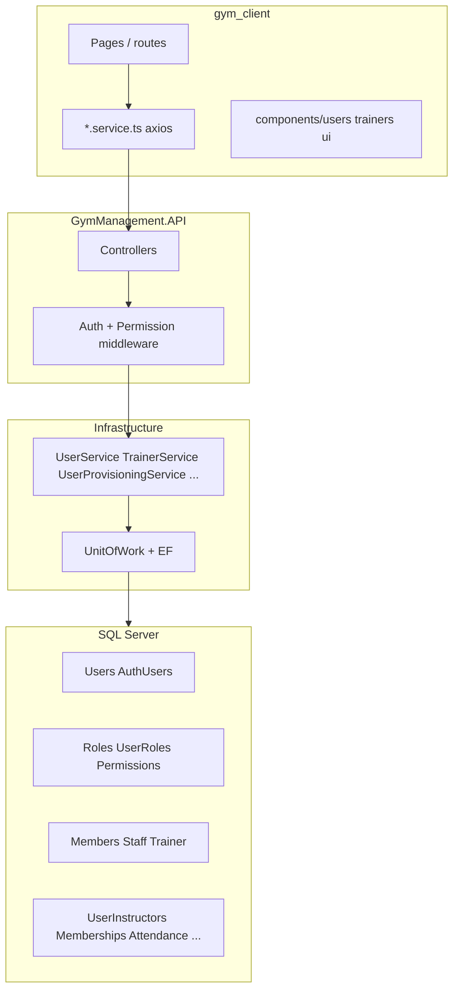
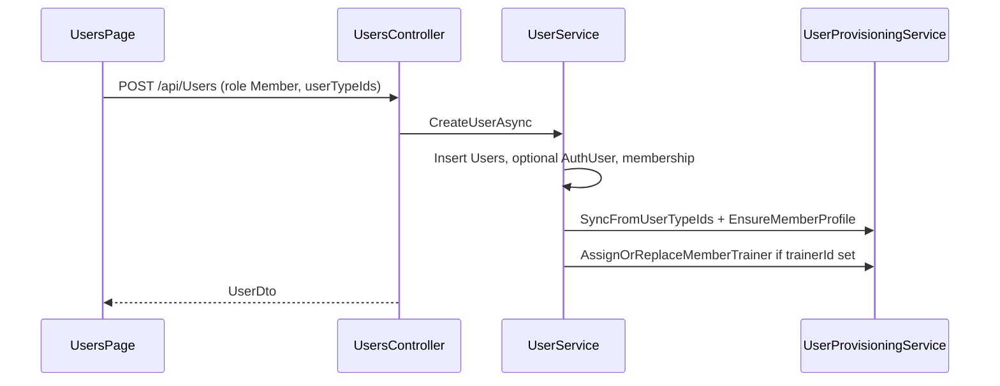
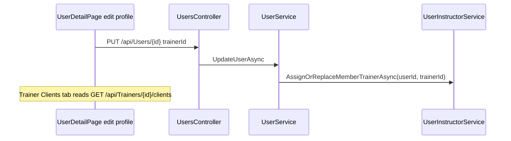

# Application flows & product model

**Purpose:** Single source of truth for how the Gym Management app works end-to-end. Use this before adding features so we extend existing flows instead of duplicating logic.

**Related docs:**

| Doc | Contents |
|-----|----------|
| [CodeWorkflow.md](../CodeWorkflow.md) | HTTP pipeline, JWT, RBAC middleware |
| [USER_ROLE_ARCHITECTURE.md](./USER_ROLE_ARCHITECTURE.md) | Roles, profiles (`Members`, `Staff`, `Trainers`), provisioning |
| [PT_MODULE.md](../PT_MODULE.md) | Personal training packages & sessions |
| [USER_GUIDE.md](../USER_GUIDE.md) | End-user operations |
| [README.md](./README.md) | Knowledge-base index |

**Last updated:** 2026-06-28 (Focused member coach assignment popup with schedule preview).

---

## 1. Stack (actual repo)

| Layer | Technology |
|-------|------------|
| Frontend | React 18 + TypeScript + Vite (`gym_client/`) |
| API | ASP.NET Core 9 (`src/GymManagement.API/`) |
| Data | EF Core + **SQL Server** (`GymManagementDb`) |
| Auth | JWT + refresh token on `AuthUsers` |

Do **not** assume Node/PostgreSQL/Prisma unless starting a new service.

---

## 2. High-level architecture


```mermaid
flowchart TB
    subgraph client [gym_client]
        Pages[Pages / routes]
        Services[*.service.ts axios]
        Shared[components/users trainers ui]
    end
    subgraph api [GymManagement.API]
        Ctrl[Controllers]
        MW[Auth + Permission middleware]
    end
    subgraph infra [Infrastructure]
        Svc[UserService TrainerService UserProvisioningService ...]
        UoW[UnitOfWork + EF]
    end
    subgraph db [SQL Server]
        Users[Users AuthUsers]
        RBAC[Roles UserRoles Permissions]
        Profiles[Members Staff Trainer]
        Ops[UserInstructors Memberships Attendance ...]
    end
    Pages --> Services --> Ctrl
    Ctrl --> MW --> Svc --> UoW --> db
```

---

## 3. Identity model (critical)

One **person** = one row in `Users`. Login = `AuthUsers` (email, password) → `UserId`.

| Concept | Table / API | UI label |
|---------|-----------|----------|
| **RBAC role** | `Roles` + `UserRoles` | **Source of truth** — edit via application role chips (`POST/DELETE /api/Roles/users/{id}/roles` or user edit profile) |
| **Legacy label** | `UserTypes` + `UserUserTypes` | **Read-only mirror** of roles for older APIs; updated by `SyncUserTypesFromRolesAsync` |
| **Member profile** | `Members` (1:1 `UserId`) | Gym member fields |
| **Trainer profile** | `Trainer` (1:1 `UserId`) | Specialization, rates, employee code |
| **Staff profile** | `Staff` (1:1 `UserId`) | Department, employee code |
| **Coach assignment** | `UserInstructors` | “Personal coach” on member — **not** the Trainer role |

### Common mistake

| User action | Wrong expectation | Correct behavior |
|-------------|-----------------|------------------|
| Check user type **Trainer** on a member | Shows on trainer **Clients** tab | Only creates staff trainer profile; assign coach via **Personal coach** dropdown |
| Member missing **MEMBER** role | Missing from **Users → Members** list | Members list filters `UserRoles` containing **MEMBER** (legacy `UserTypes` kept in sync automatically) |

### Provisioning entry point

**`IUserProvisioningService`** (`UserProvisioningService.cs`):

- `AssignRoleAsync` / `RevokeRoleAsync`
- `EnsureMemberProfileAsync` / `EnsureTrainerProfileAsync` / `EnsureStaffProfileAsync`
- `SyncFromUserTypeIdsAsync` — legacy API path: maps UserTypes → Roles + profiles
- `SyncFromRoleCodesAsync` — roles-first path
- `SyncUserTypesFromRolesAsync` — mirrors active roles onto legacy UserTypes

`UserService` create/update/delete should call provisioning — do not create `Trainer` rows in random controllers.

---

## 4. Frontend routes (dashboard)

| Route | Page | Primary API |
|-------|------|-------------|
| `/dashboard/users` | **Grid-first** members directory with compact header + summary strip; light page scroll + tall grid panel (`min-height` ~viewport) | `GET /api/Users/paged?membersOnly=true` (+ `assignedToCoachOnly=true` when coach-scoped) |
| `/dashboard/users/:id` | Member detail | `GET /api/Users/{id}` + deferred `GET /api/Users/{id}/profile-summary`; **Details** tab includes locker allocation via `GET /api/locker-management/assignments/by-user/{userId}` (locker #, locker status, assignment date/status); **Trainer** tab reads `GET /api/UserInstructors/user/{userId}` for current coach, assignment history, and notes |
| `/dashboard/trainers` | Trainers list | `GET /api/Trainers` |
| `/dashboard/trainers/:id` | Trainer detail | `GET /api/Trainers/{id}`, tabs: Clients, Schedule, … |
| `/dashboard/trainers/:id?mode=edit` | Opens edit modal | |

Auth: token in client storage; permissions gate menu items (`PermissionCodes`).

---

## 5. Flow: Create gym member


```mermaid
sequenceDiagram
    participant UI as UsersPage
    participant API as UsersController
    participant US as UserService
    participant PR as UserProvisioningService
    UI->>API: POST /api/Users (role Member, userTypeIds)
    API->>US: CreateUserAsync
    US->>US: Insert Users, optional AuthUser, membership
    US->>PR: SyncFromUserTypeIds + EnsureMemberProfile
    US->>PR: AssignOrReplaceMemberTrainer if trainerId set
    API-->>UI: UserDto
```

**Frontend:** `UsersPage.tsx` → `usersService.create`  
**Backend:** `CreateUserDto.TrainerId` → `UserInstructors` (coach), not trainer role.

**Aadhaar (optional):** `Users.AadhaarNumber` — 12 digits, unique when set. Validated in `AadhaarNumberValidator`. API returns `aadhaarNumber` only for Admin / Super Admin; others get `aadhaarNumberMasked` (`XXXX XXXX 1234`). Search: name, email, phone, or full 12-digit Aadhaar on members and trainers lists + global search. Audit log actions `Aadhaar Created` / `Aadhaar Updated`.

**Phone (required on create):** Indian mobile `^[6-9][0-9]{9}$` on `Users.Phone` (API `phone`). Normalized from `+91` / spaces / hyphens. Unique index `IX_Users_MobileNumber`. Emergency phone uses the same rules when provided. See [PHONE_VALIDATION_AUDIT.md](./PHONE_VALIDATION_AUDIT.md).

**Training schedule:** Members can use **Batch** (`PreferredGymTime`: Morning/Afternoon/Evening/Night) or **Custom** (`TrainingStartTime`, `TrainingEndTime`, `TrainingDaysOfWeek` on `Users` + `Members`). UI: `MemberTrainingScheduleFields` on `UsersPage` add modal and `UserDetailPage` edit profile. When a coach is assigned, `MemberTrainingScheduleService` blocks overlapping slots unless admin sets `overrideTrainingScheduleConflict`. Preview: `POST /api/Users/training-schedule/validate`. Trainers see labels on dashboard + trainer detail Clients/Schedule tabs.

---

## 6. Flow: Create / link trainer

Two paths:

1. **Add trainer modal** (`AddTrainerModal.tsx`): link existing user `POST /api/Trainers` or create user with Trainer type then update trainer fields.
2. **User edit:** User type Trainer + `UserProvisioningService` ensures `Trainer` row and `TRAINER` role.

Employee code: auto-generated `TRN-{year}-{######}` (`TrainerEmployeeCodeGenerator`).

---

## 7. Flow: Assign member to coach


```mermaid
sequenceDiagram
    participant UI as UserDetailPage edit profile
    participant API as UsersController
    participant US as UserService
    participant UI_svc as UserInstructorService
    UI->>API: PUT /api/Users/{id} trainerId
    API->>US: UpdateUserAsync
    US->>UI_svc: AssignOrReplaceMemberTrainerAsync(userId, trainerId)
    Note over UI: Trainer Clients tab reads GET /api/Trainers/{id}/clients
```

**Invalidate queries:** `trainer-clients`, `user`, `users`, `trainer` after assignment.

**Frontend:** `UserDetailPage` → **Trainer** tab (`?tab=trainer`) shows current coach, assignment timeline, and editable assignment notes via `PUT /api/UserInstructors/{id}`. Coach changes use the focused **Assign Personal Coach** popup from the Trainer tab, not the full profile modal. The popup reads `GET /api/UserInstructors/recommendations/{userId}` for capacity/recommended badges, shows the selected trainer working schedule from `GET /api/Trainers`, checks overlap with `POST /api/Users/training-schedule/validate`, then saves through `PUT /api/Users/{id}` with `trainerId` so the assignment path remains centralized in `UserService` / `UserInstructorService`.

---

## 8. Flow: Edit trainer profile (UI)

**Route:** `/dashboard/trainers/:trainerId` → **Edit profile** modal with two tabs:

| Tab | Data target | APIs |
|-----|-------------|------|
| **Personal details** | `Users` | `PUT /api/Users/{userId}`, photo `POST /api/FileUpload/profile/user/{userId}` |
| **Trainer module** | `Trainer` | `PUT /api/Trainers/{id}` |

Photo UI: shared **`ProfilePhotoEditor`** (camera + device + URL) — same as member edit.

---

## 9. Flow: Login & permissions

See [CodeWorkflow.md](../CodeWorkflow.md).

Summary: `POST /api/Auth/login` → JWT with roles + permission claims → `PermissionResolutionMiddleware` merges DB permissions → `[HasPermission]` on controllers.

**Web OTP (Firebase):** When `Firebase:Enabled` is true and Admin credentials + web config are set, login page shows **Password | OTP** tabs. Client loads public config from `GET /api/Auth/firebase-config`, sends SMS via Firebase Phone Auth, then exchanges the Firebase ID token at `POST /api/Auth/firebase-login`. Backend verifies token with Firebase Admin SDK and matches `AuthUsers` by `Users.Phone` (or email claim). Same JWT/session response as password login. Requires user phone on profile to match verified number.

**Change password (self-service):** Any authenticated user with an `AuthUsers` row can update their own password. `GET /api/Auth/account` returns login email and whether `currentPassword` is required (false for OTP-only accounts with no password hash yet). `POST /api/Auth/change-password` validates current password when required, min length 6, BCrypt hash on `AuthUsers`. **Web:** `/dashboard/profile` → **Password** card (`ChangePasswordCard`). **Mobile:** Profile → **Security & devices** → **Change password** (`/profile/change-password`). Admins can still reset another user’s password via `PUT /api/Users/{id}` (admin only).

**Forgot / reset password (unauthenticated):** `POST /api/Auth/forgot-password` with login email always returns a generic success message (no account enumeration). Server stores SHA-256 hash of opaque token + 1h expiry on `AuthUsers`, logs reset URL (email delivery TBD). `POST /api/Auth/reset-password` validates token + sets new password (clears refresh tokens). Link base URL: `ClientApp:PublicBaseUrl` (default `http://localhost:5173`). **Web:** `/login/forgot-password`, `/login/reset-password?token=…` (linked from login form). **Mobile:** `/login/forgot-password`, `/login/reset-password?token=…`.

**Member web post-login routing:** When the active persona is **member**, successful login navigates to `/dashboard/member/portal` (not the admin hub). Visiting `/dashboard` as member redirects to the portal (`DashboardShell` + `getPostLoginPath` / `getPersonaHomePath` in `roleRouting.ts`).

**Member self-log body metrics:** `POST /api/me/body-metrics` (authenticated member) accepts `weightKg`, optional `bodyFatPct`, `notes`, `measurementDate`. **Mobile:** Progress tab → **Log weight** sheet. Charts refresh from `GET /api/me/body-metrics`.

---

## 10. Reuse catalog (avoid duplication)

### Frontend (`gym_client/src`)

| Need | Use | Do not copy from |
|------|-----|------------------|
| Profile photo upload/camera | `components/users/ProfilePhotoEditor.tsx` | `UserDetailPage` inline camera state |
| Camera modal | `components/users/ProfilePhotoCameraModal.tsx` | — |
| Camera helpers | `lib/cameraMedia.ts` | — |
| API errors | `lib/apiErrors.ts` `getApiErrorMessage` | ad-hoc axios parsing |
| Change own password | `auth.service.ts` + `ChangePasswordCard` | duplicate forms |
| Trainers CRUD | `services/trainers.service.ts` | mock `trainers-management` store (legacy) |
| Users CRUD | `services/users.service.ts` | — |
| Trainer add wizard | `components/trainers/AddTrainerModal.tsx` | `TrainersManagementPage` mock |
| Add / renew membership | `components/memberships/AddUserMembershipModal.tsx` | inline create form on pages |
| Member membership modal state | `lib/memberMembershipState.ts` | ad-hoc status checks in UI |

### Backend (`src/`)

| Need | Use |
|------|-----|
| User + role + profiles | `IUserProvisioningService` |
| Trainer assignment | `IUserInstructorService.AssignOrReplaceMemberTrainerAsync` |
| RBAC checks | `IRbacService` + `PermissionCodes` |
| Trainer employee code | `TrainerEmployeeCodeGenerator` |
| Staff employee code | `StaffEmployeeCodeGenerator` |
| Unit of work | `IUnitOfWork` — add repos there when new tables |

### When adding a new “person-like” profile

1. Add table 1:1 `UserId` in Domain.  
2. Register in `ApplicationDbContext` + `IUnitOfWork`.  
3. Extend `UserProvisioningService.EnsureProfileForRoleAsync`.  
4. Expose DTO + optional `GET /api/{profile}` list.  
5. Reuse `ProfilePhotoEditor` on frontend (identity photo stays on `Users`).

---

## 11. API quick reference

| Area | Base route |
|------|------------|
| Auth | `/api/Auth` |
| Users | `/api/Users` |
| User aggregate | `GET /api/Users/{id}/aggregate` |
| Assign role | `POST /api/Users/{id}/roles` body `{ roleCode }` (or Config UI: `POST /api/Roles/users/{id}/roles`) |
| Roles & user assignment UI | `/dashboard/roles` — tabs **Role permissions** / **User roles**; APIs `GET /api/Roles/user-assignments`, assign/revoke under `/api/Roles/users/...` |
| Members list | `GET /api/Members` |
| Staff list | `GET /api/Staff` |
| Trainers | `/api/Trainers`, `GET/POST .../clients` |
| Upload photo | `POST /api/FileUpload/profile/user/{userId}` |
| Permissions | `GET /api/Users/{id}/permissions` |
| Live workout tracking | `/api/workout/*` (see §14) |
| Health profile | `/api/HealthProfile` (see §15) |

---

## 15. Health Profile (medical screening)

Normalized tables: `users_health_profile`, `users_medical_conditions`, `users_medications`, `users_injuries`, `users_emergency_contacts`. Risk level (`Low` / `Moderate` / `High`) computed on save via `HealthProfileRiskEngine`.

| Step | API | UI |
|------|-----|-----|
| Staff edit member | `PUT /api/HealthProfile/user/{userId}` | `/dashboard/users/:userId/health-profile` |
| Member self-service | `PUT /api/HealthProfile/me` | `/dashboard/member/health-profile` |
| Trainer / staff read | `GET /api/HealthProfile/user/{userId}/summary` | User detail banner, workout assignment modal |

Trainers assigned via `UserInstructors` can read (not write) a client's profile. Assign workouts only after reviewing summary panel.

**Code:** `HealthProfileService`, `HealthProfileController`, `gym_client/src/modules/health-profile/`.

---

## 16. Supplement Tracking (member protocols)

Catalog + assignments (distinct from legacy `UserSupplements` free-text table and from retail POS inventory).

| Table | Purpose |
|-------|---------|
| `supplements_master` | Name, category, default dosage, active flag, optional `ProductId` → `Retail_Products` |
| `member_supplements` | Per-member assignment: dosage, timing, dates, status, assigned-by, optional product link |

| Step | API | UI |
|------|-----|-----|
| Manage catalog | `GET/POST/PUT/DELETE /api/SupplementMaster` | `/dashboard/supplements/master` |
| Assign to member | `POST /api/MemberSupplements` | User detail panel, `/dashboard/users/:userId/supplements` |
| Member read | `GET /api/MemberSupplements/me` | `/dashboard/member/supplements` |
| Trainer/staff read | `GET /api/MemberSupplements/user/{id}` | User detail (compact), full page + timeline |
| Analytics | `GET /api/MemberSupplements/analytics` | Catalog page dashboard strip |

**Auth:** trainers read/write clients via `UserInstructors`; staff via `UsersAccess`; members read own assignments only.

**Code:** `SupplementTrackingService`, `SupplementMasterController`, `MemberSupplementsController`, `gym_client/src/modules/supplement-tracking/`.

**Migrate:** `20260530194055_AddSupplementTrackingModule`.

---

## 14. Live workout tracking (member execution)

**Templates** stay on `WorkoutPlans` / `WorkoutPlanExercises`. **Performed** work is stored on existing `WorkoutSessions` (extended columns) plus new `WorkoutSessionExercises` (per set). Legacy `WorkoutLogs` + `MeController` complete-session flow remain unchanged.

| Step | API | UI |
|------|-----|-----|
| Resolve member id | `GET /api/workout/my-member-id` | `useMemberId` hook |
| Start | `POST /api/workout/start` `{ memberId, workoutPlanId }` | `/dashboard/member/workouts/today` |
| Active session | `GET /api/workout/active/{memberId}` | `/dashboard/member/workouts/live` |
| Log set | `POST /api/workout/log-set` | Live page per-set Save |
| Complete | `POST /api/workout/complete/{sessionId}` | Live page Complete |
| History | `GET /api/workout/exercise-history/{memberId}/{exerciseId}` | History modal on live page |
| Dashboard stats | `GET /api/workout/dashboard/{memberId}` | `WorkoutDashboardWidget` on member dashboard |
| Trainer visibility | `GET /api/workout/trainer/members` | Trainer dashboard panel + `/dashboard/training/workouts-to-review` |

**Rules:** one `InProgress` session per member; completion % = completed sets / total sets; volume = Σ(weight × reps). On complete, rows sync into `WorkoutLogs` for backward-compatible history.

**Code:** `WorkoutTrackingService`, `WorkoutTrackingController`, `gym_client/src/modules/workout-tracking/`.

**Mobile (PulseFit / `mobile app/`):** `SessionRecoveryService` (local → server → start), `OfflineWorkoutRepository` (Hive), `SyncManager` (queue, 60s periodic, connectivity), autosave every 20s. Mirror after each online log; clear only on confirmed complete. Sync chip on Home / Profile / Live.

| Role | API | Web route |
|------|-----|-----------|
| Trainer review hub | `GET /api/workout/trainer/members` | `/dashboard/training/workouts-to-review` |
| Trainer timeline | `GET /api/workout/trainer/members/{memberId}/timeline` | `/dashboard/training/member-workouts/:memberId` |
| Session detail (review sets) | `GET /api/workout/session/{sessionId}/detail` | Modal on review + timeline pages |
| Admin monitoring | `GET /api/workout/admin/monitoring` | `/dashboard/training/workout-monitoring` |

**Active API** `GET /api/workout/active/{memberId}` returns envelope (`session`, `lastSyncedAt`, `serverTimeUtc`). Unique index: one `InProgress` session per member.

**Migrate:** `dotnet ef database update --project src/GymManagement.Infrastructure --startup-project src/GymManagement.API` (migrations `AddWorkoutTrackingSessionExercises`, `WorkoutOneActiveSessionPerMember`).

---

## 14b. Personal workout plans (audit + GymSettings)

**Model:** `WorkoutPlans.PlanType` = `Program` (default, existing templates) or `Personal` with `AssignedToUserId`. Program library APIs exclude personal rows. **One personal plan per member** enforced by filtered unique index `UX_WorkoutPlan_OnePersonalPlanPerUser` and `GymSettings` (`AllowMemberWorkoutPlanCreation`, `MaxPersonalWorkoutPlansPerMember`; `-1` = unlimited).

| Access | Rule |
|--------|------|
| Member | Own personal plan only (`/api/personal-workout-plans/mine`) |
| Admin | Full access + audit viewer |
| Trainer | **No** access to personal plans (API returns 403) |

| Action | API | Notes |
|--------|-----|-------|
| Member create/list/delete | `/api/personal-workout-plans/mine` | Delete uses transactional audit |
| Member get/save structure | `GET/PUT .../mine/{id}`, `PUT .../mine/{id}/structure` | Logs `ExerciseAdded` / `Updated` / `Removed` on save |
| Member UI | `/dashboard/member/workouts` (panel), `/dashboard/member/workouts/personal/:planId` (weekly editor) | Reuses `WeekScheduleTab` |
| Admin delete personal | `DELETE /api/WorkoutPlans/{id}` | Same audit path when `PlanType=Personal` |
| Audit history (admin) | `GET /api/workout-plan-audit` | Permission `VIEW_WORKOUT_PLAN_AUDIT` |
| UI audit screen | `/dashboard/training/workout-plan-audit` | Filters: member, dates, action |

**Delete flow (personal only):** EF transaction → full JSON snapshot in `workout_plan_audit_logs` → verify audit id → soft-delete exercises/days/weeks/schedules/plan → commit; rollback on any failure.

**Audit retention:** `workout_plan_audit_logs` are never auto-deleted.

**Code:** `WorkoutPlanAuditService`, `PersonalWorkoutPlanService`, `GymSettingsService`, migration `20260604180000_AddPersonalWorkoutPlanAuditAndGymSettings`.

---

## 14c. Workout categories, warmups & stretches (smart templates)

**Model:** `WorkoutCategories` with junction tables `WorkoutCategoryWarmups` / `WorkoutCategoryStretches`. Program templates (`WorkoutPlans`) optionally link `WorkoutCategoryId` with `UseDefaultWarmups` / `UseDefaultStretches` (default **true**). When true, mobile and API resolve mobility from the category; when false, use `WorkoutPlanWarmups` / `WorkoutPlanStretches`. Existing plans without a category keep working (empty mobility).

| Admin | API | UI |
|-------|-----|-----|
| Category CRUD | `GET/POST/PUT/DELETE /api/workout-categories` | `/dashboard/training/workout-categories` |
| Category defaults | `PUT /api/workout-categories/{id}/warmup-stretch` | Category detail: default warmups/stretches |
| Warmup / stretch masters | `/api/warmups`, `/api/stretches` | Warmups / Stretches pages |
| Plan mobility | `PUT /api/Programs/{id}/warmup-stretch` | Program detail → Warmup & Stretch tab |
| Create program | `POST /api/Programs` (requires `workoutCategoryId`) | Programs → Create (category step) |

**Mobile flow (PulseFit):** Workout detail → **Overview** (counts + est. duration) → warmup (countdown + timer + skip) → live workout → stretch → **Summary**. Template from `GET /api/me/workout-session-template/{planId}` includes resolved warmups/stretches and `estimatedDurationSeconds`.

**Audit:** `WorkoutPlanAuditAction` 20–27 (category CRUD, category mobility links, plan auto-assignment). Migration `20260610140000_AddWorkoutCategories`; SQL script `docs/sql/add-workout-categories.sql`.

---

## 11b. User memberships (one occupying membership per member)

**Rule:** A member may have only **one occupying** membership at a time: `Active`, `ActivePendingPayment`, `PartialPayment`, `Frozen`, `Pending`, or `VoidPending`. While any of these exists, **no new membership row may be created** — use **Collect payment** (outstanding balance on current period), **Extend access** (add plan duration to current end date), or **Change plan or dates** (edit / approval). Returns **409** (`ACTIVE_MEMBERSHIP_EXISTS`) with plan, status, dates, remaining days, and actions. `Expired`, `Cancelled`, and `Voided` allow a new membership.

**Enforced in:** DB unique index `IX_user_memberships_one_active_per_user` (Active only), `UserMembershipConflictGuard` (all occupying statuses), `UserMembershipService` / `UserService`, `GET /api/UserMemberships/active-conflict/{userId}`, and `/dashboard/user-memberships` conflict modal.

**Add / renew from Members list:** Users grid → **Memberships** action → `MemberMembershipsModal` loads `GET /api/UserMemberships/by-user/{userId}`. State from `deriveMemberMembershipModalState` (`memberMembershipState.ts`):

| State | UI |
|-------|-----|
| No membership | **+ Add Membership** |
| Active / occupying | **Renew membership** extends the current row’s end date by plan duration (staff action, no admin approval). Use **Collect payment** when the current period still has a balance. Use **Change plan or dates** (edit / approval) only for retroactive corrections. |
| Expired history only | **Renew Membership** (prefills last plan, `intent: renew`) + **+ New Membership** |
| Inactive history only (voided/cancelled) | **+ Add Membership** |

Both entry points use shared **`AddUserMembershipModal`** → `POST /api/UserMemberships` (optional `creationSource`, `intent`, `priorMembershipId` for audit). Permission: **`Payments`** (`authService.canPaymentsAccess()`). Member is locked in the list modal; `/dashboard/user-memberships` opens the same modal with member picker. **Reactivation:** creating a new membership for an inactive member sets **`Users.IsActive = true`** automatically (`MemberAccountReactivation` in `UserMembershipService` / `UserService`). **Member profile:** onboarding **Manage memberships** opens the same `MemberMembershipsModal`; **Membership History** tab uses shared `MemberMembershipManagePanel` (add / renew buttons identical to the grid modal).

**`/dashboard/user-memberships` (member plans page):** `MembershipBillingNav`; **`GET /api/UserMemberships/summary`** KPI cards; paged list with `search` (incl. membership ID), `status`, `needsPayment`, `expiringWithinDays`, `includeTerminal`, `membershipId`; grid columns **Timeline** + **Payment**; URL `?quick=needsPayment|expiring14|…&membershipId=`. Collapsible **Renewal focus** strip (`UserMembershipRenewalFocusStrip`). ID / **View details** opens **`UserMembershipDetailDrawer`** (billing summary, audit, actions). **Export CSV** (up to 500 filtered rows). Sectioned **Edit** modal; paid rows use **`RequestMembershipChangeModal`** → approvals. **Help** module `user_memberships`. Components: `UserMembershipsSummaryStrip`, `UserMembershipsToolbar`, `UserMembershipsGrid`, `EditUserMembershipModal`.

**Existing duplicates** (e.g. two `ActivePendingPayment` rows for Rajesh Yadav) must be fixed manually: void/cancel or expire one row, then use the remaining membership for payment or upgrade.

**Workout & diet assignment:** Requires **`MembershipStatus.Active`** with a valid end date (not expired). Enforced in API (`MemberTrainingEligibilityGuard` on `POST` user schedules / diet assignments) and UI (member profile onboarding, Details tab, assign pages). Pending-payment or expired members must renew or activate membership first.

---

## 11c. Membership lifecycle (no delete)

**Policy:** `user_memberships` rows are **never** physically deleted. Staff request changes; admins approve. Terminal statuses: `Cancelled`, `Voided`, `Transferred`.

| Status | Meaning | Badge |
|--------|---------|-------|
| `Active` | Current paid/active | Green |
| `Expired` | End date passed | Gray |
| `Cancelled` | Admin-approved cancel | Orange |
| `VoidPending` | Void requested | Yellow |
| `Voided` | Admin-approved void | Red |
| `Transferred` | Transferred out | Blue |

**Void flow:** Memberships grid → **Request void** (not delete) → `POST /api/membership-requests` (`RequestType: Void`) → membership → `VoidPending` → admin **Membership approvals** → **Approve** (ADMIN role or `APPROVE_MEMBERSHIP_REQUEST`) → `Voided`. Voided rows are hidden from the default membership list; history remains under member **Membership History** and `GET /api/membership-audit`. Payments and audit rows are retained. **Created** audit entries show who originally added a duplicate row.

**Renew / extend access:** Staff renew extends the same row (plan + end date). Mistaken renewals can be undone with **Revert last renewal** (`POST /api/UserMemberships/{id}/revert-last-renewal`), which restores plan, dates, and status from the last `Renewed` audit entry. Does not remove payment records. Preview: `GET …/last-renewal-revert-preview`.

**Post-payment edits:** Arbitrary plan/date/status changes on an existing paid period (via **Edit**) require an approval request (`DateChange`, `PlanChange`, etc.). **Renew / extend access** is a normal staff action and does not require approval.

**Routes:** `/dashboard/payments/membership-approvals` (admin queue), user detail → **Membership History** tab (all statuses visible).

**APIs:** `POST/GET /api/membership-requests`, `POST …/approve`, `POST …/reject`, `GET /api/membership-audit`. `DELETE /api/UserMemberships/{id}` returns **400** with *"Membership deletion is not allowed. Submit a void request."*

**Tables:** `membership_approval_requests`, `membership_audit_logs`.

**Permissions:** `Payments` (submit/list), `APPROVE_MEMBERSHIP_REQUEST` (admin approve/reject), `VIEW_MEMBERSHIP_AUDIT` (audit log).

**Migrate:** `20260603092400_MembershipLifecycleAndUniqueActiveMembership`.

**Dashboard:** Active member count = distinct users with `Status = Active` only. Revenue excludes payments tied to `Voided` memberships.

---

## 12. Enterprise membership billing & payments

**Tables:** `membership_payments` (billing header per `user_memberships`), `membership_payment_transactions` (installments with receipt, status, void/refund audit), `waive_off_requests`, `financial_audit_logs`.

### Financial formula

```
Net Payable = Membership Fee − Coupon Discount − Approved Waive-Off
Outstanding = Net Payable − Sum(Completed installment amounts)
```

Only transactions with **Status = Completed** count toward paid/outstanding. **Voided** and **Refunded** rows stay in history but are excluded from totals.

### Routes (web)

| Route | Purpose |
|-------|---------|
| `/dashboard/payments` | Billing hub + legacy payment log |
| `/dashboard/payments/collect?membershipId=` | Collect installment (confirmation modal, duplicate check, receipt) |
| `/dashboard/payments/history` | Transaction list, filters, void/refund |
| `/dashboard/payments/waive-offs` | Request list; admin approve/reject |
| `/dashboard/payments/membership-approvals` | Membership void/cancel/change approvals |
| `/dashboard/payments/reports` | Collection, outstanding, coupon, waive-off, void/refund reports + CSV export |
| User detail → **Payment History** tab | Financial summary card, member ledger, billing table; **Send email** / **Send SMS** per completed installment (`POST /api/membership-payments/transactions/{id}/send-receipt`) — respects member opt-in and gym SMTP / WhatsApp webhook config |

### APIs

| Area | Base route |
|------|------------|
| Membership billing | `/api/membership-payments` |
| Waive-off | `/api/waive-off-requests` |
| Coupon on billing | `/api/membership-payments/{id}/apply-coupon` |

**Permissions:** `Payments` (collect, view), `VOID_PAYMENT` (manager+ void), `REFUND_PAYMENT` (admin refund), `APPROVE_WAIVE_OFF` (admin waive-off), `VIEW_FINANCIAL_AUDIT` (audit log), `Reports` (collection reports).

**Migrate:** `dotnet ef database update --project src/GymManagement.Infrastructure --startup-project src/GymManagement.API` (migration `20260601120000_EnterpriseBillingPaymentsWaiveOff`).

**Code:** `MembershipPaymentService`, `WaiveOffRequestService`, `BillingCalculationService`, `gym_client/src/components/billing/*`, `CollectMembershipPaymentPage`, `MembershipPaymentHistoryPage`, `WaiveOffRequestsPage`.

---

## 12b. QR attendance check-in (membership gate)

**Goal:** Block gym entry via QR when membership is missing or not valid — protects revenue without blocking staff who scan for testing.

| Step | API | UI |
|------|-----|-----|
| Member scans branch QR | `POST /api/Attendance/scan` (mobile + web) | `/dashboard/scan`, Flutter QR flow |
| Legacy alias | `POST /api/qr/scan` | Owner QR tools |

**Gate (after geo + duplicate-scan checks, before `AttendanceLog` insert):**

| Allow check-in | Deny (`errorCode: membership_expired`, HTTP 400) |
|----------------|--------------------------------------------------|
| `Active`, `ActivePendingPayment`, `PartialPayment` with `EndDate >= today` | No membership row; `Expired`; `Frozen`; `Voided` / `Cancelled` / `Transferred`; past `EndDate` |

**Exempt roles** (gate skipped): `ADMIN`, `TRAINER`, `STAFF`, `RECEPTIONIST`, `ACCOUNTANT`.

**Rules:** `UserMembershipRules.AllowsGymCheckIn` in `GymManagement.Core/Validation/UserMembershipRules.cs`.

**Implementation:** `GymQrService.ScanAsync` → `EvaluateMembershipForCheckInAsync`; `AttendanceScanOrchestrator` forwards `ErrorCode` on `AttendanceScanResponseDto`.

**Client UX:** Web `ScanResult` + toast when `membership_expired`; mobile maps same code to `AttendanceMembershipExpired` (renew at reception).

**Renew path:** Members list → **Memberships** modal or `/dashboard/payments/collect` after staff adds/renews plan (§11b, §12).

**Staff renewal queue:** Dashboard → **Renewal queue** panel (`GET /api/UserMemberships/expiring-queue?withinDays=14`). Lists memberships **ending within 14 days** (`Active`, `ActivePendingPayment`, `PartialPayment`) and **recently expired** rows (last 30 days). Each item includes billing summary: `pendingAmount`, `paymentStatus`, `isFullyPaid`. **Fully paid** members still appear because renewal (new plan period) is separate from installment collection — use **Renew** / **Renew access**. **Collect** shows only when `pendingAmount > 0`. Actions: **Collect** → `/dashboard/payments/collect`, **Renew** → shared `MemberMembershipsModal`. Requires `Payments` permission. Refreshes with dashboard KPIs after payment or membership change.

**Member in-app expiry reminders:** `MembershipExpiryReminderHostedService` → `MembershipExpiryInAppNotificationService` writes `Notifications` rows (`type: membership_expiring`) at **14 / 7 / 3 / 1 / 0** days before end. Enabled by `Notifications:EnableInAppMembershipExpiryReminders` (default **true**), window `InAppMembershipExpiryReminderDays` (default **14**). Independent of outbound webhooks (`EnableScheduledReminders`). Optional FCM push when `Notifications:EnablePushNotifications` and Firebase Admin credentials are configured.

**Payment due reminders:** `PaymentBillingReminderHostedService` → `CreateDueDateNotificationsAsync` writes `payment_due` notifications (and push when enabled).

**Workout day reminders:** `WorkoutDayReminderHostedService` → `WorkoutDayReminderService` creates `workout_today` notifications when the member has an active `UserSchedules` row matching today's weekday (IST). Toggle: `Notifications:EnableWorkoutDayReminders` (default **true**).

**Notifications nav group:** Sidebar → **Notifications** (collapsible, **Config** permission) groups **Email settings** (`/dashboard/settings/email`), **SMS settings** (`/dashboard/settings/sms`), and **Notification templates** (`/dashboard/settings/notification-templates`).

**Admin SMTP email:** Dashboard → **Email settings** (`/dashboard/settings/email`, **Config** permission). Admin saves Gmail/Outlook/custom SMTP in `GymSettings` (app password encrypted). Sends payment receipts, membership expiry reminders (14/7/3/1/0 days), and diet assignments when enabled. API: `GET/PUT /api/EmailSettings`, `POST /api/EmailSettings/test`. See [NOTIFICATION_WEBHOOKS.md](../NOTIFICATION_WEBHOOKS.md).

**Admin SMS / WhatsApp:** Dashboard → **SMS settings** (`/dashboard/settings/sms`, **Config**). The page has **two independent channel sections — SMS and WhatsApp** — each DB-backed (`GymSettings.Sms*` and `GymSettings.WhatsApp*`) with its own enable, webhook URL, optional sender id, optional encrypted `Authorization` header, and payment-receipt / expiry-reminder toggles. `ISmsTransportService` (`SmsWebhookTransportService`) **fans out** the templated text envelope to every enabled+configured channel (DB config first; WhatsApp falls back to legacy `Notifications:WhatsAppWebhookUrl`), applying per-channel event toggles; it succeeds if at least one channel delivers. The envelope `channel` field is `"sms"` or `"whatsapp"`. Used by the outbox, the dispatcher, and the per-channel test endpoint. Expiry reminders are scheduled when any channel allows them. API: `GET/PUT /api/SmsSettings`, `POST /api/SmsSettings/test` (with `channel`). Members still need `ReceiveSmsNotifications` on.

**Notification template engine:** Dashboard → **Notification templates** (`/dashboard/settings/notification-templates`, **Config**). DB-backed HTML email + SMS templates with `{{Placeholder}}` replacement, admin edit/preview/test-send/reset, outbox queue + `NotificationOutboxHostedService` (retry, history audit). File defaults under `GymManagement.Infrastructure/Templates/`. API: `GET/PUT /api/notification-templates`, preview, test-send, history. Wired events include payment success (invoice PDF attachment when available), membership renewal/expired, diet assignment, forgot-password reset, welcome/new member, attendance check-in, workout assignment, and trainer assignment.

**Member notification opt-in:** `Users.ReceiveEmailNotifications` / `ReceiveSmsNotifications` (default **off** for existing and new members). Outbound email/SMS only when the member (or admin on their profile) opts in. **Self-service:** `GET/PUT /api/me/notification-preferences`. **Web:** `/dashboard/profile` → Notification preferences. **Mobile:** Profile → Notifications. **Admin:** User detail → Edit profile → Notification preferences.

**Outbound webhooks (email / WhatsApp, optional):** Membership expiry milestones via `MembershipExpiryWebhookReminderService` → `INotificationWebhookDispatcher` (runs alongside SMTP when configured). Set `Notifications:EmailWebhookUrl` / `WhatsAppWebhookUrl`. Ops guide: [NOTIFICATION_WEBHOOKS.md](../NOTIFICATION_WEBHOOKS.md).

**Member billing in app:** `GET /api/me/invoices` lists membership payment headers + receipt lines; `GET /api/me/invoices/{membershipPaymentId}/pdf` downloads invoice PDF (own records only). **Mobile:** Membership tab → **Billing & receipts** + **Payment due** card when balance is pending.

**Online payments (Razorpay):** Configure `Commercial:EnableOnlinePayments`, `RazorpayKeyId`, `RazorpayKeySecret`. Members pay via `POST /api/me/payments/razorpay/order` → Razorpay Checkout → `POST /api/me/payments/razorpay/verify` → `MembershipPaymentService.RecordInstallmentAsync` (`Method = Online`). Orders tracked in `online_payment_orders`. Payment-blocked members may still call `/api/me/payments/*`, `/api/me/invoices`, and `/api/me/membership-billing/*`.

**Self-signup:** When `Commercial:EnableSelfSignup` is **true**:

| Step | Surface | API / route |
|------|---------|-------------|
| 1 | Landing **Plans** CTA | `/signup` |
| 2 | Choose plan + account form | `GET /api/public/membership-plans`, `GET /api/public/config` |
| 3 | Create member + login | `POST /api/public/signup` → `UserService.CreateUserAsync` (MEMBER provisioning, plan, billing header) |
| 4 | Pay online (optional) | Razorpay flow above; web signup page opens checkout when enabled |
| 5 | Member home | Web → `/dashboard/member/portal`; mobile → existing login |

**Web routes:** `/signup` (public), `/dashboard/member/pay` (authenticated pay page). **Login** links to signup when self-signup is enabled.

**Config flags (`appsettings` → `Commercial`):** `EnableSelfSignup` (default **true** in dev template), `EnableOnlinePayments`, `RazorpayKeyId`, `RazorpayKeySecret`, `CheckoutBusinessName`.

**Push tokens:** `POST /api/me/push-token` stores FCM token on `UserDevices` (`FcmToken`). Mobile `PushNotificationService.syncAfterLogin` registers after login when FCM is wired (requires `google-services.json` + `firebase_messaging`).

| Surface | API / UI |
|---------|----------|
| Mobile home | `GET /api/me/dashboard` → `recentNotifications`; full list `/notifications` → `GET /api/me/notifications` |
| Member web dashboard | `MemberNotificationsPanel` on `/dashboard` |
| Mark read | `POST /api/me/notifications/{id}/read` |
| Invoices (mobile) | Membership tab → `GET /api/me/invoices` |
| Pay online (web) | `/dashboard/member/pay` → Razorpay checkout |
| Self-signup (web) | `/signup` → `POST /api/public/signup` |

---

## 12c. Staff front-desk menu (web)

**Who:** `STAFF` or `RECEPTIONIST` app role without owner-level nav (`ADMIN`, `Reports`, or `Config` permission → full admin sidebar).

**Sidebar:** `getStaffFrontDeskNavLinks()` in `gym_client/src/features/auth/navPermissions.ts` — permission-filtered links:

| Link | Requires |
|------|----------|
| Dashboard | — |
| Attendance | — |
| Members | `UsersAccess` |
| Memberships, Collect payment | `Payments` |
| Check-in | — |
| Lead CRM | `LEADS_CRM` or `LEADS_TRAINER` |

**Dashboard:** `FrontDeskDashboardPage` (renewal queue, quick actions) instead of owner `AdminDashboardPage`.

**Route guard:** `isPathAllowedForRole` + `getStaffFrontDeskAllowedPrefixes()` — blocks gym-ops, roles, analytics, etc.; allows `/dashboard/users/:id` and `/dashboard/payments/collect` under prefix rules.

**Code:** `SidebarNav.tsx` (brand subtitle **Front Desk**), `DashboardHubPage.tsx`, `roleRouting.ts`.

---

## 13. Device management & session security (mobile)

**Tables:** `UserDevices`, `UserSessions`, `LoginHistory` (see migration `20260531130000_AddDeviceManagementModule`).

**Mobile login:** `POST /api/Auth/login` accepts optional `device` payload (unique id, model, platform, app version). Server registers/updates device, enforces **max 3 active devices** (`DeviceSecurity:MaxActiveDevices`), creates `UserSessions` row (JWT `jti` + refresh hash), writes `LoginHistory`, and may return `securityAlert` (new device / unusual location). Device limit → **409** `DEVICE_LIMIT_REACHED` with active device list; client may retry with `removeDeviceId`.

**Session rules:** JWT access **8 hours** (480 min), refresh **90 days** dev / **14 days** production (`Jwt:AccessTokenMinutes`, `Jwt:RefreshTokenDays`). `JwtSessionValidationMiddleware` rejects revoked mobile sessions; web logins without `UserSessions` row still work. Web UI warns 2 minutes before access token expiry and can refresh via refresh token.

**Member APIs (`/api/me`):**

| Route | Purpose |
|-------|---------|
| `GET /devices?currentDeviceUniqueId=` | List active devices |
| `DELETE /devices/{id}` | Remove device + invalidate its sessions |
| `POST /devices/logout-all` | Revoke all sessions for user |
| `GET /login-history` | Login audit for member |

**Admin:** `GET /api/admin/device-security/analytics` (Reports permission) — dashboard on **Security** page.

**Mobile UI:** Profile → **Security & devices** → device cards, login history, logout all. Login shows device-limit sheet when 409.

**Migrate:** `dotnet ef database update --project src/GymManagement.Infrastructure --startup-project src/GymManagement.API`

---

## 14. Improvement backlog (doc-owned)

Track cross-cutting refactors here; move to PRODUCT_BACKLOG when scheduled.

- [x] **P2:** React role chips wired to `/users/{id}/roles`; User detail edit profile uses `UserApplicationRolesEditor`; members list filters `UserRoles` (MEMBER).
- [ ] **P2:** Extract shared “edit person” form sections (personal fields) used by User + Trainer modals.
- [ ] Deprecate `modules/trainers-management` mock Zustand UI or gate behind dev flag.
- [ ] Move member-only fields from `Users` → `Members` read path (display from `Members` first).
- [ ] `FileUpload` trainer endpoint use in UI if photo stored only on `Trainer` row.
- [ ] Document each major module in `docs/modules/*.md` (retail, leads, gym-ops).

---

## 15. How to update this doc

When you change a **user-visible flow** or add a **shared component**:

1. Update the relevant section above (or add a § under module).  
2. Add a line to §12 if follow-up refactor is needed.  
3. Bump **Last updated** at the top.  
4. Keep `.cursor/rules/gym-application-context.mdc` in sync if “always do X” rules change.
